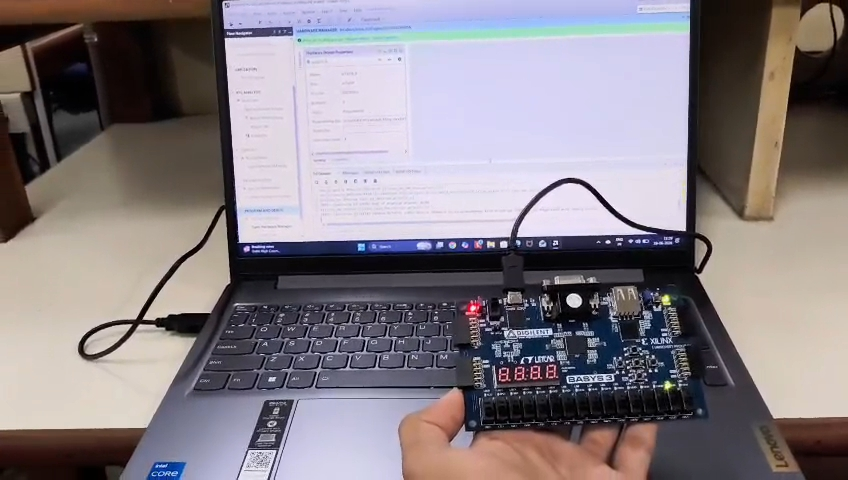

# Single-Cycle RISC-V Processor (RV32I)

## Overview

This project implements a 32-bit Single-Cycle RISC-V Processor based on the RV32I Base Integer Instruction Set Architecture (ISA) using Verilog HDL.

The processor was developed as part of the VLSI-CAD Summer Internship 2026 at NIT Rourkela and was successfully simulated, synthesized, and implemented on the Digilent Basys3 FPGA board using AMD Xilinx Vivado.

The design follows the classical single-cycle datapath, where each instruction completes all five stages—Instruction Fetch (IF), Instruction Decode (ID), Execute (EX), Memory Access (MEM), and Write Back (WB)—within a single clock cycle.

---

## Features

* RV32I Base Integer ISA Support
* Single-Cycle Processor Architecture
* Modular RTL Design
* Verilog HDL Implementation
* FPGA Implementation on Basys3
* Vivado Simulation and Verification
* LED-Based Debug Interface
* Instruction and Data Memory Support
* Register File with 32 General-Purpose Registers
* Branch and Jump Instruction Support

---

## Processor Architecture

The processor consists of the following modules:

### Program Counter (PC)

Maintains the address of the current instruction and updates the next instruction address.

### Instruction Memory

Stores program instructions loaded using `$readmemh`.

### Control Unit

Decodes instruction opcodes and generates datapath control signals.

### Immediate Generator

Extracts and sign-extends immediates for I, S, B, U, and J instruction formats.

### Register File

Implements 32 general-purpose registers (x0–x31) with dual read ports and one write port.

### ALU Control Unit

Generates specific ALU operations using opcode, funct3, and funct7 fields.

### Arithmetic Logic Unit (ALU)

Performs arithmetic, logical, comparison, and shift operations.

### Branch Unit

Evaluates branch conditions including BEQ, BNE, BLT, BGE, BLTU, and BGEU.

### Data Memory

Supports byte, half-word, and word load/store operations.

---

## Supported RV32I Instructions

### R-Type

ADD, SUB, SLL, SLT, SLTU, XOR, SRL, SRA, OR, AND

### I-Type

ADDI, SLTI, SLTIU, XORI, ORI, ANDI, SLLI, SRLI, SRAI

### Load Instructions

LB, LH, LW, LBU, LHU

### Store Instructions

SB, SH, SW

### Branch Instructions

BEQ, BNE, BLT, BGE, BLTU, BGEU

### Jump Instructions

JAL, JALR

### Upper Immediate Instructions

LUI, AUIPC

---

## FPGA Implementation



Target Board:

*  Basys3 FPGA
* Xilinx Artix-7
* 100 MHz Onboard Clock

The processor includes a tick generator that slows instruction execution to human-observable speed, allowing processor states to be monitored using onboard LEDs and switches.

---

## Project Structure

```text
rtl/
├── top_riscv.v
├── pc.v
├── instruction_memory.v
├── control_unit.v
├── imm_gen.v
├── register_file.v
├── alu_control.v
├── alu.v
├── branch_unit.v
└── data_memory.v

simulation/
├── tb_riscv.v
└── program.mem

constraints/
└── riscv.xdc
```

## Tools Used

* Verilog HDL
* AMD Xilinx Vivado
* Vivado Simulator
* Digilent Basys3 FPGA Board

---

## Results

✔ Functional simulation completed


✔ RTL and synthesis verification completed

✔ FPGA implementation completed

✔ Successful execution of RV32I test program

---

## Learning Outcomes

Through this project, I gained practical experience in:

* Computer Architecture
* RISC-V ISA
* Verilog HDL
* RTL Design
* FPGA Design Flow
* Hardware Verification
* Digital System Design
* Processor Datapath Development

---

## Author

Moursagna Rao Korla (Mourya)

B.Tech Electronics and Communication Engineering

Anurag University

VLSI-CAD Summer Internship 2026, NIT Rourkela
